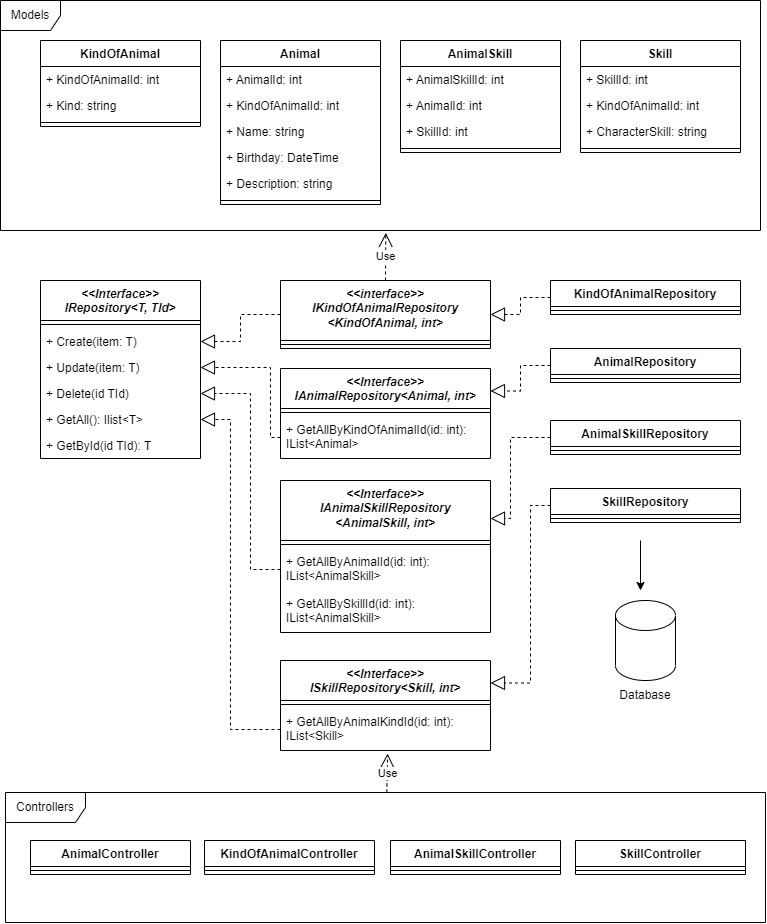
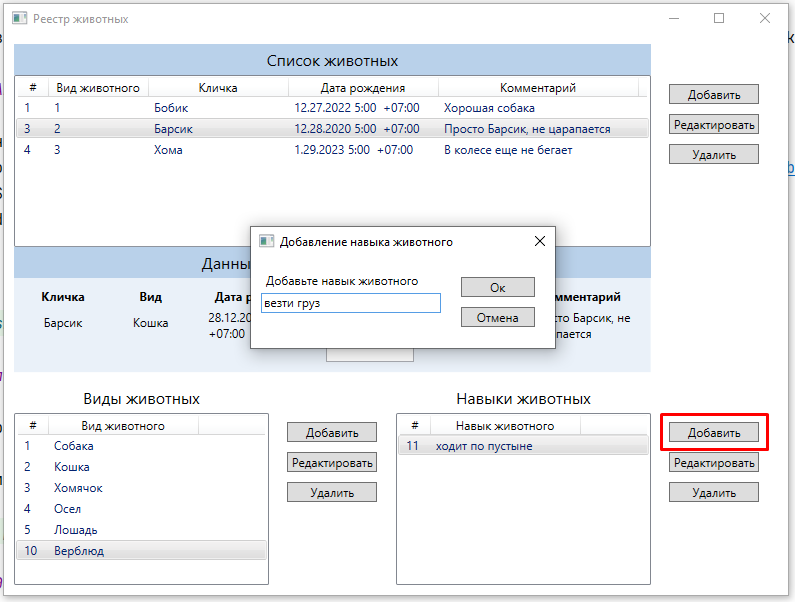

# Приложение имитирующее работу реестра домашних животных

## Задание

13. Создать класс с Инкапсуляцией методов и наследованием по диаграмме.

Диаграмма БД. Реализация БД отличается от реализации прошлых заданий по работе с MySQL

БД реестра состоит из четырех таблиц.

* Таблица вида животного (kind_of_animal)
* Таблица навыков (skill). Связь таблици видов с навыками "один ко многим", каждый вид может иметь несколько навыков.
* Таблица животных (animal). Связана с таблицей вида. Связь также "один ко многим", 
к каждому виду может относиться несколько животных
* Животное связано с навыками, связь "многие ко многим". Каждое животное может обладать несколькими навыками 
и навык может принадлежать разным животным. Связано через таблицу animal_skill

Реализованы foreign keys, каскадное удаление при удалении типа животного, навыков из таблиц

14. Написать программу, имитирующую работу реестра домашних животных.
    В программе должен быть реализован следующий функционал:  
    14.1 Завести новое животное  
    14.2 определять животное в правильный класс  
    14.3 увидеть список команд, которое выполняет животное  
    14.4 обучить животное новым командам  
    14.5 Реализовать навигацию по меню
15. Создайте класс Счетчик, у которого есть метод add(), увеличивающий̆ значение внутренней̆ int переменной̆ на 1
    при нажатии “Завести новое животное” Сделайте так, чтобы с объектом такого типа можно было работать в
    блоке try-with-resources. Нужно бросить исключение, если работа с объектом типа счетчик была не в
    ресурсном try и/или ресурс остался открыт. Значение считать в ресурсе try,
    если при заведении животного заполнены все поля.

## Решение AnimalRegistry

Решение выполнено в двух частях - WebAPI REST сервис AnimalRegistryAPI и клиентское приложение RegistryDesktopApp

Сервис - [AnimalRegistry/AnimalRegistryAPI](AnimalRegistry/AnimalRegistryAPI)  
Клиентское приложение - [RegistryDesktopApp](RegistryDesktopApp)

### AnimalRegistryAPI

1. Решение выполнено для СУБД MySQL.
2. API собрано в docker-контейнер blinktreeman/animalregistryapi https://hub.docker.com/repository/docker/blinktreeman/animalregistryapi/general
3. Для работы с MySQL добавлен контейнер с СУБД
4. API при помощи docker-compose развернуто по адресу http://bcomms.ru:5000/

Диаграмма классов

### Клиентское приложение RegistryDesktopApp

Для приложения выбрана платформа WPF. Для работы с API сгенерирован Swagger client

Общий вид приложения

#### Добавление видов животных

С видами животных также доступны операции редактирования и удаления

#### Добавление навыков для животных

Навыки привязаны к конкретному типу животного

Также доступны операции изменения и удаления

#### Добавление животного

Выбираем вид животного, имя, дату рождения, добавляем комментарий

Детальные данные по животному.  
Навыки (команды) у вновь созданного животного отсутствуют.

#### "Обучаем" животное добавляем навыки

Животное "обучили" команде/навыку

