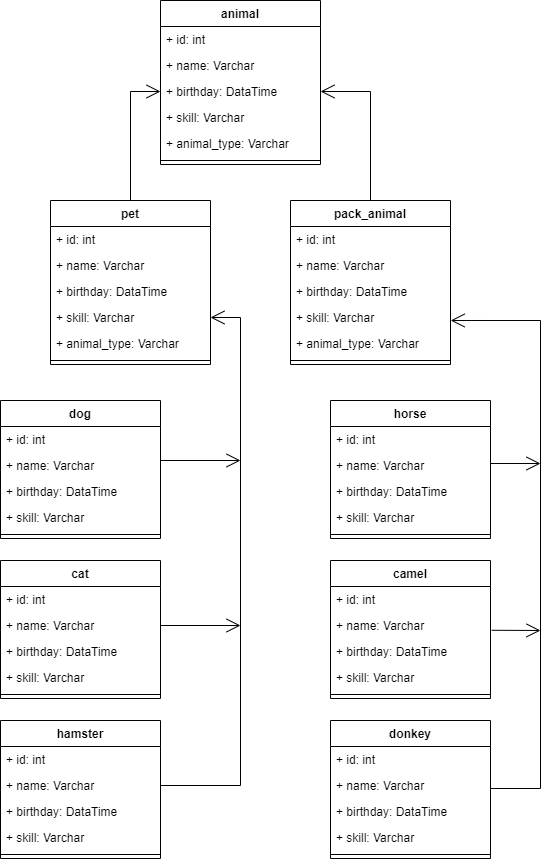

# Работа с SQL

## Задание

6. Нарисовать диаграмму, в которой есть класс родительский класс, домашние животные и вьючные животные,
   в составы которых в случае домашних животных войдут классы: собаки, кошки, хомяки, а в класс вьючные животные
   войдут: Лошади, верблюды и ослы).



7. В подключенном MySQL репозитории создать базу данных “Друзья человека”
----
### Решение

```shell
MySQL localhost:3306 ssl SQL > CREATE SCHEMA IF NOT EXISTS mans_friends;
MySQL localhost:3306 ssl SQL > SHOW DATABASES;
+--------------------+
| Database           |
+--------------------+
| information_schema |
| mans_friends       |
| mysql              |
| performance_schema |
| sakila             |
| sys                |
| world              |
+--------------------+
7 rows in set (0.0010 sec)
```

8. Создать таблицы с иерархией из диаграммы в БД
----
### Решение

```shell
MySQL localhost:3306 ssl SQL > USE mans_friends
Default schema set to `mans_friends`.
Fetching global names, object names from `mans_friends` for auto-completion... Press ^C to stop.
# Создаем таблицу dog
MySQL localhost:3306 ssl mans_friends SQL > CREATE TABLE IF NOT EXISTS dog (
                                         ->   iddog INT PRIMARY KEY NOT NULL AUTO_INCREMENT,
                                         ->   name VARCHAR(45) NOT NULL,
                                         ->   birthday DATETIME NOT NULL,
                                         ->   skill VARCHAR(45) NULL);
Query OK, 0 rows affected (0.0134 sec)
```

Аналогично для таблиц cat, hamster, horse, camel, donkey:

```shell
 MySQL localhost:3306 ssl mans_friends SQL > SHOW TABLES;
+------------------------+
| Tables_in_mans_friends |
+------------------------+
| camel                  |
| cat                    |
| dog                    |
| donkey                 |
| hamster                |
| horse                  |
+------------------------+
6 rows in set (0.0016 sec)
```

9. Заполнить низкоуровневые таблицы именами(животных), командами которые они выполняют и датами рождения
----
### Решение

Заполняем таблицу dog

```shell
 MySQL localhost:3306 ssl mans_friends SQL > INSERT dog (
                                          ->     name,
                                          ->     birthday,
                                          ->     skill
                                          -> )
                                          -> VALUES
                                          ->    ('Шарик', '2022-01-01', 'сидеть'),
                                          ->    ('Бобик', '2021-01-01', 'лежать'),
                                          ->    ('Полкан', '2012-01-01', 'фас');
Query OK, 3 rows affected (0.0056 sec)
Records: 3  Duplicates: 0  Warnings: 0
```

Аналогично для таблиц cat, hamster, horse, camel, donkey

```shell
 MySQL localhost:3306 ssl mans_friends SQL > SELECT * FROM cat;
+-------+--------+---------------------+--------+
| iddog | name   | birthday            | skill  |
+-------+--------+---------------------+--------+
|     1 | Мурзик | 2018-01-01 00:00:00 | шипеть |
|     2 | Барсик | 2020-01-01 00:00:00 | играть |
+-------+--------+---------------------+--------+
2 rows in set (0.0005 sec)
```

10. Удалив из таблицы верблюдов, т.к. верблюдов решили перевезти в другой питомник на зимовку.
    Объединить таблицы лошади, и ослы в одну таблицу.
----

### Решение

Удаляем верблюдов

```shell
MySQL localhost:3306 ssl mans_friends SQL > DELETE FROM camel;
Query OK, 2 rows affected (0.0043 sec)

MySQL localhost:3306 ssl mans_friends SQL > SELECT * FROM camel;
Empty set (0.0005 sec)
```

Создаем таблицу для вьючных животных, добавляя в нее лошадей

```shell
MySQL localhost:3306 ssl mans_friends SQL > CREATE TABLE pack_animals (
                                         ->   idpack_animals INT PRIMARY KEY NOT NULL AUTO_INCREMENT
                                         -> )
                                         -> SELECT
                                         ->     name,
                                         ->     birthday,
                                         ->     skill,
                                         ->     'horse' as animal_type
                                         -> FROM
                                         ->     horse;
Query OK, 2 rows affected (0.0135 sec)
Records: 2  Duplicates: 0  Warnings: 0

MySQL localhost:3306 ssl mans_friends SQL > SELECT * FROM pack_animals;
+----------------+--------+---------------------+---------+-------------+
| idpack_animals | name   | birthday            | skill   | animal_type |
+----------------+--------+---------------------+---------+-------------+
|              1 | Конь   | 2018-01-01 00:00:00 | скакать | horse       |
|              2 | Лошадь | 2019-01-01 00:00:00 | везти   | horse       |
+----------------+--------+---------------------+---------+-------------+
2 rows in set (0.0005 sec)
```

Добавляем в нее ослов

```shell
MySQL localhost:3306 ssl mans_friends SQL > INSERT INTO pack_animals (
                                         ->   name,
                                         ->   birthday,
                                         ->   skill,
                                         ->   animal_type)
                                         -> SELECT name, birthday, skill, 'donkey' as animal_type
                                         -> FROM donkey;
Query OK, 2 rows affected (0.0030 sec)
Records: 2  Duplicates: 0  Warnings: 0

MySQL localhost:3306 ssl mans_friends SQL > SELECT * FROM pack_animals ;
+----------------+-----------+---------------------+---------+-------------+
| idpack_animals | name      | birthday            | skill   | animal_type |
+----------------+-----------+---------------------+---------+-------------+
|              1 | Конь      | 2018-01-01 00:00:00 | скакать | horse       |
|              2 | Лошадь    | 2019-01-01 00:00:00 | везти   | horse       |
|              4 | Осел      | 2021-01-01 00:00:00 | везти   | donkey      |
|              5 | Тоже_Осел | 2022-01-01 00:00:00 | везти   | donkey      |
+----------------+-----------+---------------------+---------+-------------+
4 rows in set (0.0006 sec)
```

Аналогично собираем таблицы dog, cat, hamster в таблицу pet

```shell
MySQL localhost:3306 ssl mans_friends SQL > SELECT * FROM pet;
+-------+--------+---------------------+----------------+-------------+
| idpet | name   | birthday            | skill          | animal_type |
+-------+--------+---------------------+----------------+-------------+
|     1 | Шарик  | 2022-01-01 00:00:00 | сидеть         | dog         |
|     2 | Бобик  | 2021-01-01 00:00:00 | лежать         | dog         |
|     3 | Полкан | 2012-01-01 00:00:00 | фас            | dog         |
|     4 | Мурзик | 2018-01-01 00:00:00 | шипеть         | cat         |
|     5 | Барсик | 2020-01-01 00:00:00 | играть         | cat         |
|     7 | Хома   | 2023-01-01 00:00:00 | крутить колесо | hamster     |
+-------+--------+---------------------+----------------+-------------+
6 rows in set (0.0008 sec)
```

11. Создать новую таблицу “молодые животные” в которую попадут все животные старше 1 года, но младше 3 лет и в
    отдельном столбце с точностью до месяца подсчитать возраст животных в новой таблице
----

### Решение

```shell
MySQL localhost:3306 ssl mans_friends SQL > CREATE TABLE young_animals (
                                         ->   idyoung_animals INT PRIMARY KEY NOT NULL AUTO_INCREMENT
                                         -> )
                                         -> SELECT
                                         ->   name,
                                         ->   birthday,
                                         ->   skill,
                                         ->   animal_type,
                                         ->   (TIMESTAMPDIFF(MONTH, birthday, CURDATE())) as age_months
                                         -> FROM
                                         ->   (SELECT * FROM pack_animals UNION SELECT * FROM pet) s
                                         -> WHERE birthday BETWEEN CURDATE() - INTERVAL 3 YEAR 
                                         ->       AND CURDATE() - INTERVAL 1 YEAR;
Query OK, 4 rows affected (0.0143 sec)
Records: 4  Duplicates: 0  Warnings: 0

MySQL localhost:3306 ssl mans_friends SQL > SELECT * FROM young_animals;
+-----------------+-----------+---------------------+--------+-------------+------------+
| idyoung_animals | name      | birthday            | skill  | animal_type | age_months |
+-----------------+-----------+---------------------+--------+-------------+------------+
|               1 | Осел      | 2021-01-01 00:00:00 | везти  | donkey      |         25 |
|               2 | Тоже_Осел | 2022-01-01 00:00:00 | везти  | donkey      |         13 |
|               3 | Шарик     | 2022-01-01 00:00:00 | сидеть | dog         |         13 |
|               4 | Бобик     | 2021-01-01 00:00:00 | лежать | dog         |         25 |
+-----------------+-----------+---------------------+--------+-------------+------------+
4 rows in set (0.0005 sec)
```

12. Объединить все таблицы в одну, при этом сохраняя поля, указывающие на прошлую принадлежность к старым таблицам.
----

### Решение

```shell
MySQL localhost:3306 ssl mans_friends SQL > CREATE TABLE animals (
                                         -> idanimals INT PRIMARY KEY NOT NULL AUTO_INCREMENT
                                         -> )
                                         -> SELECT
                                         ->   name,
                                         ->   birthday,
                                         ->   skill,
                                         ->   animal_type
                                         -> FROM
                                         ->   (SELECT * FROM pack_animals UNION SELECT * FROM pet) s;
Query OK, 10 rows affected (0.0129 sec)
Records: 10  Duplicates: 0  Warnings: 0

MySQL localhost:3306 ssl mans_friends SQL > SELECT * FROM animals;
+-----------+-----------+---------------------+----------------+-------------+
| idanimals | name      | birthday            | skill          | animal_type |
+-----------+-----------+---------------------+----------------+-------------+
|         1 | Конь      | 2018-01-01 00:00:00 | скакать        | horse       |
|         2 | Лошадь    | 2019-01-01 00:00:00 | везти          | horse       |
|         3 | Осел      | 2021-01-01 00:00:00 | везти          | donkey      |
|         4 | Тоже_Осел | 2022-01-01 00:00:00 | везти          | donkey      |
|         5 | Шарик     | 2022-01-01 00:00:00 | сидеть         | dog         |
|         6 | Бобик     | 2021-01-01 00:00:00 | лежать         | dog         |
|         7 | Полкан    | 2012-01-01 00:00:00 | фас            | dog         |
|         8 | Мурзик    | 2018-01-01 00:00:00 | шипеть         | cat         |
|         9 | Барсик    | 2020-01-01 00:00:00 | играть         | cat         |
|        10 | Хома      | 2023-01-01 00:00:00 | крутить колесо | hamster     |
+-----------+-----------+---------------------+----------------+-------------+
10 rows in set (0.0006 sec)
```